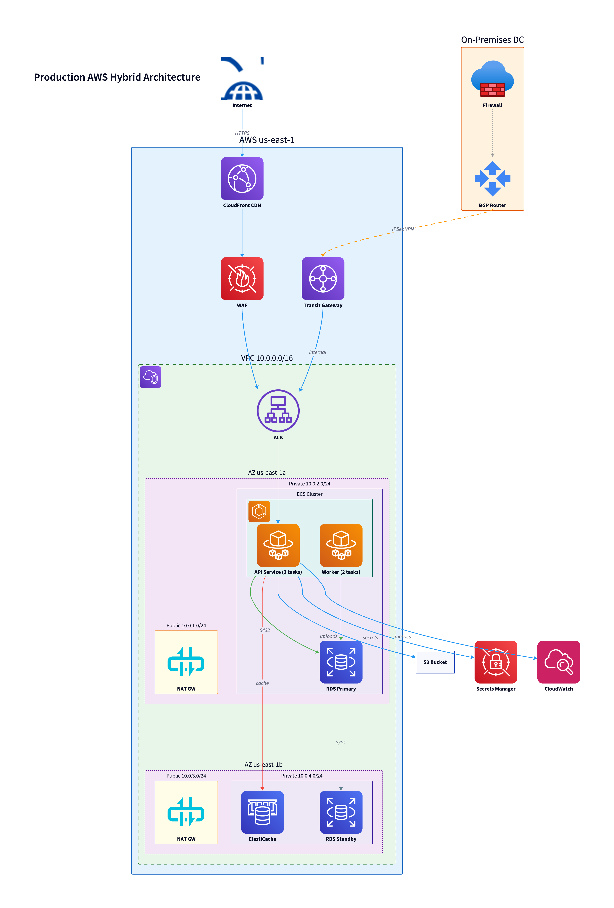
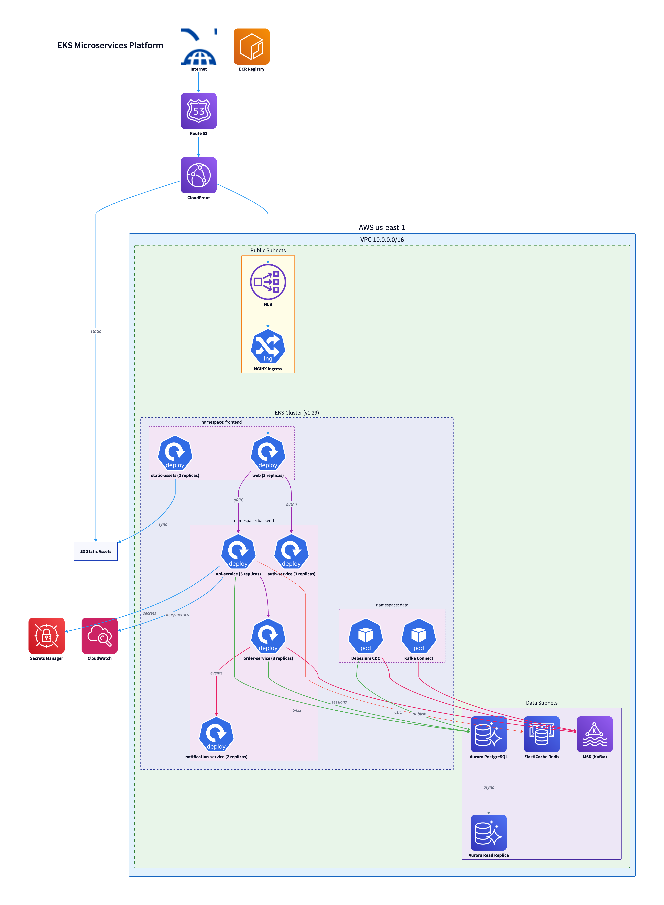
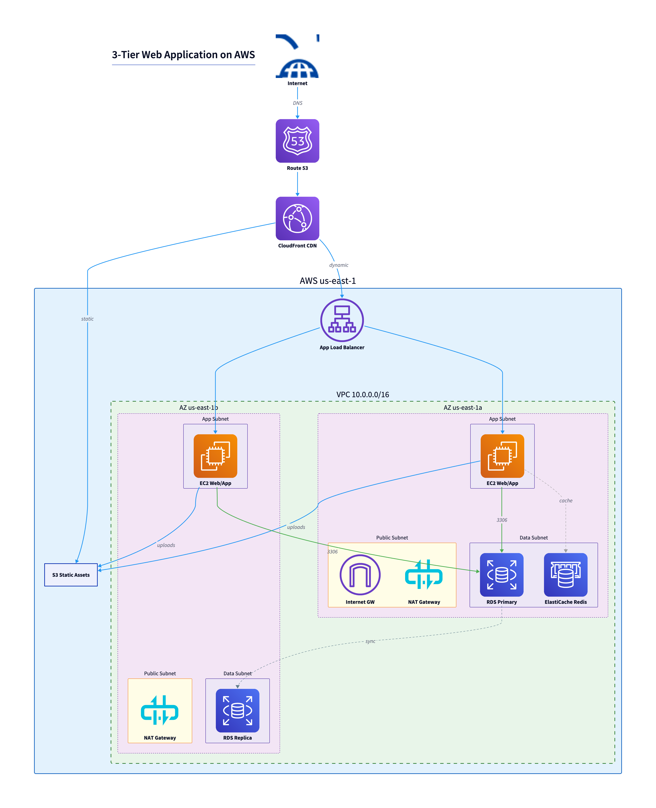
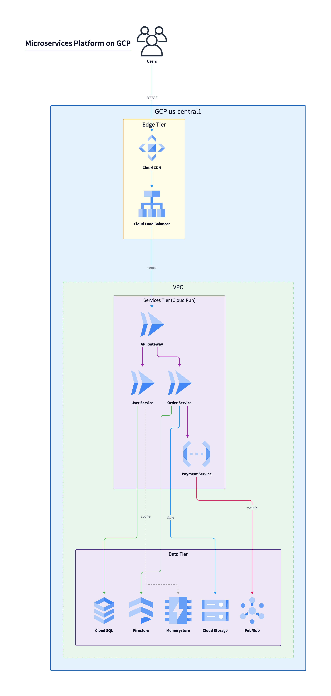
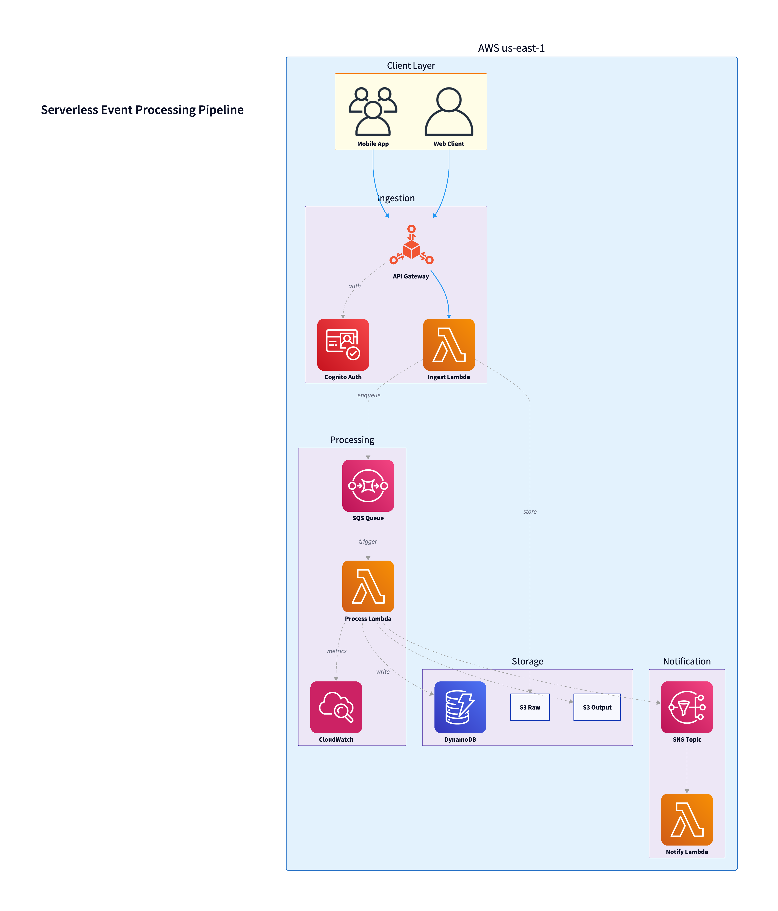

# architect-diagram

Generate clean cloud architecture diagrams from natural language descriptions or YAML specs.

Two rendering engines:
- **D2** — nested VPCs, AZs, subnets, ECS/EKS clusters, hybrid on-prem/cloud topologies
- **Python diagrams** — simple conceptual diagrams (5-15 services, no deep nesting)

`src/architect.py` uses Claude to convert natural language to the right YAML spec and auto-routes to the correct engine.

## Quick install

```bash
# D2 renderer
brew install d2                          # macOS
curl -fsSL https://d2lang.com/install.sh | sh   # Linux

# Graphviz (for simple diagrams engine)
brew install graphviz                    # macOS
apt-get install graphviz                 # Linux (Debian/Ubuntu)

# Python packages
pip install pyyaml anthropic diagrams

# API key for natural language mode
export ANTHROPIC_API_KEY=sk-ant-...
```

See `installation.md` for Windows, full platform coverage, and troubleshooting.

## Quick usage

```bash
# Natural language → diagram (auto-detects engine)
python3 src/architect.py "3-tier web app with CloudFront, ALB, EC2 auto-scaling, RDS, ElastiCache"

# Force D2 for VPC/K8s/hybrid
python3 src/architect.py "AWS VPC with ECS, RDS Aurora, on-prem DC via VPN" --engine d2

# From a YAML spec directly
python3 src/generate_d2.py examples/complex_aws_hybrid.yaml
python3 src/generate_d2.py examples/eks_microservices.yaml --icons online
```

## Documentation

| Document | Contents |
|---|---|
| `SKILL.md` | Main reference: usage, schema, icons, generation rules, examples |
| `installation.md` | Platform-specific install + troubleshooting |
| `yaml-schema.md` | Complete YAML schema with annotated examples |
| `icon-reference.md` | All icon short names, modes, custom icons |

## Examples

Five reference architectures are included in `examples/`. Each has a YAML spec and a rendered PNG.

---

### Production AWS Hybrid Architecture

VPC with 2 AZs, ECS Fargate cluster, RDS Multi-AZ, NAT Gateways, CloudFront + WAF at the edge, on-premises DC connected via IPSec VPN through Transit Gateway.

**Engine:** D2 &nbsp;|&nbsp; **Spec:** `examples/complex_aws_hybrid.yaml`



---

### EKS Microservices Platform

EKS cluster with 3 namespaces (frontend, backend, data), Aurora PostgreSQL, MSK Kafka, ElastiCache, gRPC service mesh, Debezium CDC pipeline, CloudFront + NLB ingress.

**Engine:** D2 &nbsp;|&nbsp; **Spec:** `examples/eks_microservices.yaml`



---

### 3-Tier Web Application on AWS

Classic three-tier setup: Route 53 → CloudFront → ALB → EC2 in two AZs → RDS Primary/Replica + ElastiCache Redis, S3 for assets.

**Engine:** D2 &nbsp;|&nbsp; **Spec:** `examples/three_tier_web_app.yaml`



---

### Microservices Platform on GCP

GCP Cloud CDN → Load Balancer → Cloud Run services (API Gateway, User Service, Order Service, Payment Service) → Cloud SQL, Firestore, Memorystore, Pub/Sub, Cloud Storage.

**Engine:** D2 &nbsp;|&nbsp; **Spec:** `examples/microservices_gcp.yaml`



---

### Serverless Event Processing Pipeline

Mobile/web clients → Cognito → API Gateway → Lambda → SQS → processing Lambda → DynamoDB + S3, SNS notification fan-out, CloudWatch observability.

**Engine:** D2 &nbsp;|&nbsp; **Spec:** `examples/serverless_event_pipeline.yaml`


